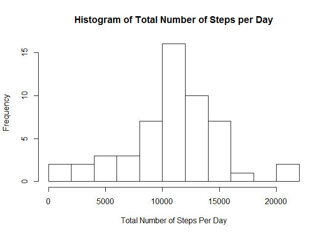
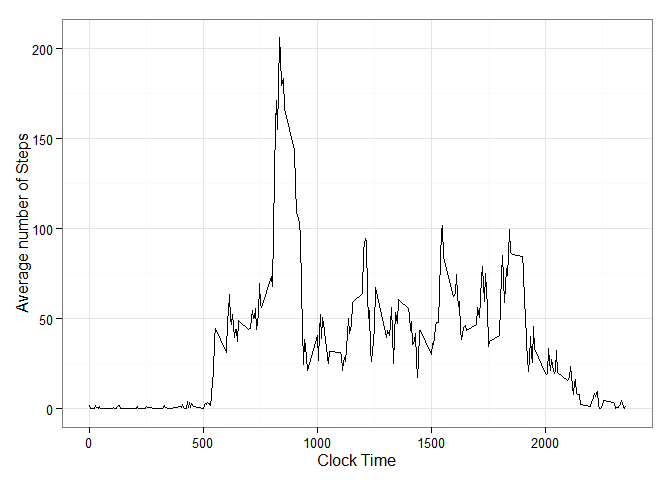
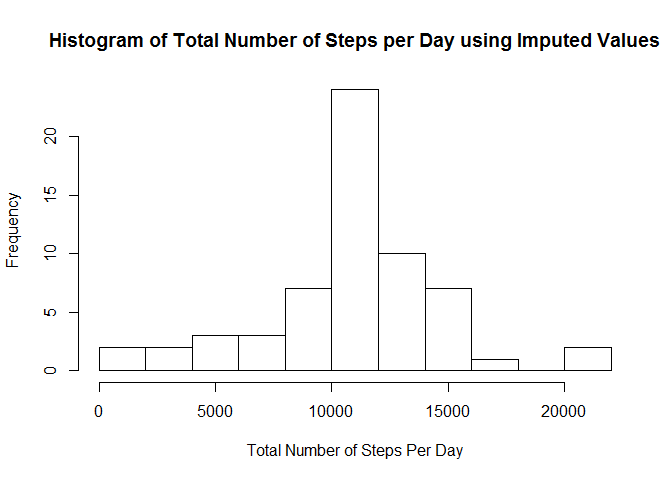
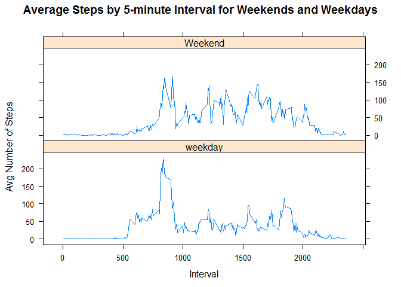

# PA_template.Rmd
CTSMIGHTYDOG  
Wednesday, October 14, 2015  

#Introduction
This is an R Markdown document that will be used for the Coursera peer assignment #1.  The data used in this assignment is taken from data about personal movement using activity monitoring devices such as [Fitbit](http://www.fitbit.com/), [Nike Fuelband](http://www.nike.com/us/en_us/c/nikeplus-fuel) and [Jawbone Up](https://jawbone.com/up). The dataset can be downloaded from the course website:

Data: [Activity Monitoring Data](https://d396qusza40orc.cloudfront.net/repdata%2Fdata%2Factivity.zip).

The variables included in this dataset are:

- **steps:** Number of steps taking in a 5-minute interval (missing values are coded as NA) 
- **date:** The date on which the measurement was taken in YYYY-MM-DD format
- **interval:** Identifier for the 5-minute interval in which measurement was taken

The dataset is stored in a comma-separated-value (CSV) file and there are a total of 17,568 observations in this dataset.

#Start of Assignment
##Loading and preprocessing the data

Set the global items like the necessary packages, and the echo=TRUE option so that the code chunks may be observed.

```r
library(knitr)
```

```
## Warning: package 'knitr' was built under R version 3.2.2
```

```r
opts_chunk$set(echo = TRUE)
library(ggplot2)
library(dplyr)
```

```
## 
## Attaching package: 'dplyr'
## 
## The following object is masked from 'package:stats':
## 
##     filter
## 
## The following objects are masked from 'package:base':
## 
##     intersect, setdiff, setequal, union
```

```r
library(lattice)
```

Download and read the data file

```r
#data download website
url<-"http://d396qusza40orc.cloudfront.net/repdata%2Fdata%2Factivity.zip"
download.file(url, "activity.zip", mode="wb")
unzip("activity.zip")
#read in csv data
rawdata<-read.csv("activity.csv", header=TRUE, colClasses=c("numeric", "character", "numeric"))
rawdata$date <- as.Date(rawdata$date, format = "%Y-%m-%d")
```

##What is the mean total number of steps taken per day?
###**The mean total number of steps is shown in the histogram below**

```r
#calculate the total number of steps per day
totalsteps<-aggregate(steps~date,rawdata, sum)
#Make a histogram of the total number of steps taken per day
hist(totalsteps$steps, breaks=10, xlab="Total Number of Steps Per Day", main="Histogram of Total Number of Steps per Day")
```

 

##What is the mean and median total number of steps taken per day?

```r
#calculate the mean and median of steps per day
mean_steps<-mean(totalsteps$steps)
mean_steps
```

```
## [1] 10766.19
```

```r
median_steps<-median(totalsteps$steps)
median_steps
```

```
## [1] 10765
```
###**The mean number of steps taken per day is 10766 and the median number of steps taken per day is 10765.**

##What is the average daily activity pattern?
###**The average daily activity pattern is shown in the time series chart below**

```r
#Calculate the average number of steps per time interval and relabel step to Avg_step
Avgstep<-aggregate(steps~interval, rawdata, mean)
colnames(Avgstep)[2]<-"Avg_step"
#plot the time series chart
ggplot(data=Avgstep, aes(x=interval, y=Avg_step)) + geom_line()+ theme_bw() + xlab("Clock Time") + ylab("Average number of Steps") 
```

 

##Which 5-minute interval, on average across all the days in the dataset, contains the maximum number of steps

```r
Maxstep<-Avgstep[which.max(Avgstep$Avg_step),1]
Maxstep
```

```
## [1] 835
```

```r
Maxcount<-Avgstep[which.max(Avgstep$Avg_step),2]
Maxcount
```

```
## [1] 206.1698
```
###**The 5 minute interval that contains the maximum number of steps is at 835 with a step count of 206.**

##Imputing missing values
##Calculate and report the total number of missing values in the dataset 

```r
missing<-sum(is.na(rawdata$steps))
missing
```

```
## [1] 2304
```
###**The total number of missing values is 2304.**

##Devise a strategy for filling in all of the missing values in the dataset. 
###**Missing values will use the mean value for the 5 minute interval.**  
##Create a new dataset that is equal to the original dataset but with the missing data filled in.

```r
#add an average number of steps/interval to the raw data set.
mergeddata<-merge(rawdata, Avgstep, by="interval")
#Fill in the average number of steps/interval where step count in the raw data were NA.
mergeddata$steps <- ifelse(is.na(mergeddata$steps), mergeddata$Avg_step, mergeddata$steps)
```

##Make a histogram of the total number of steps taken each day and Calculate and report the mean and median total number of steps taken per day. 

```r
#calculate the new total number of steps per day
Newtotalsteps<-aggregate(steps~date,mergeddata, sum)
#Make a new histogram of the total number of steps taken per day
hist(Newtotalsteps$steps, breaks=10, xlab="Total Number of Steps Per Day", main="Histogram of Total Number of Steps per Day using Imputed Values")
```

 

```r
#calculate the mean and median of the steps per day using imputed values
Newmean_steps<-mean(Newtotalsteps$steps)
Newmean_steps
```

```
## [1] 10766.19
```

```r
Newmedian_steps<-median(Newtotalsteps$steps)
Newmedian_steps
```

```
## [1] 10766.19
```
###**The mean number of steps taken per day is 10766 and the median number of steps taken per day is 10766**.

##Do these values differ from the estimates from the first part of the assignment? 
###**The mean value does not differ from the first part.**  
###**The median value only differs by 1 step.**

##What is the impact of imputing missing data on the estimates of the total daily number of steps?
###**There isn't a large impact on the estimates of the total daily number of steps when using imputed values.**


##Are there differences in activity patterns between weekdays and weekends?
##Create a new factor variable in the dataset with two levels - "weekday" and "weekend" indicating whether a given date is a weekday or weekend day.

```r
mergeddata$day <- weekdays(as.Date(mergeddata$date))
mergeddata$day <- ifelse(mergeddata$day %in% c("Saturday","Sunday"), "Weekend", "weekday")
```

##Make a panel plot containing a time series plot of the 5-minute interval (x-axis) and the average number of steps taken, averaged across all weekday days or weekend days (y-axis). 

```r
#Calculate the average steps by weekday/weekend
activity_impute_mean <- mergeddata %>% group_by(day, interval) %>% 
  summarize(mean.steps = mean(steps))

#plot the time series chart
xyplot(mean.steps ~ interval | day, data = activity_impute_mean, 
       type = "l", layout = c(1,2), xlab = "Interval", ylab = "Avg Number of Steps", 
       main = "Average Steps by 5-minute Interval for Weekends and Weekdays")
```

 

###**By examining the plot above, there are clear differences in activity between weekends and weekdays.  The plot indicates that people are more active during the weekends than they are during the week.**


